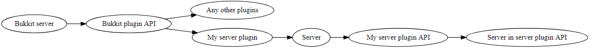
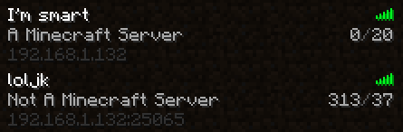

### yo dawg I heard you liked Minecraft servers.

... so I wrote a Minecraft server in a Bukkit plugin for a Minecraft server :D

This plugin is for Minecraft release 1.0.

This plugin was originally just a proof of concept, but now I plan on writing an actual server with it. The goal is to write enough to support an API which can in turn be used to write a server in a plugin:

  
*Generated with [http://www.webgraphviz.com/](http://www.webgraphviz.com/)*

### Installing this plugin

Drop the plugin jar into your server's plugins folder, reload the server, and connect to the same IP as your server port `25065`.

Working server list ping (`0xFE` Client -> Server, `0xFF` Server -> Client)

Logging into the server:

### For other devs

I built this against `craftbukkit-1.0.0-SNAPSHOT.jar`

### Licensing

Plugin: MIT, have fun.
Wiki.vg documentation: CC BY-SA 4.0 - No changes have been made, it is directly saved from web archive for ease-of-access purposes only. Documentation belongs to the wiki.vg contributors exclusively, and I claim no ownership of the documentation.
