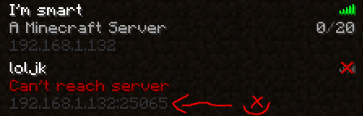
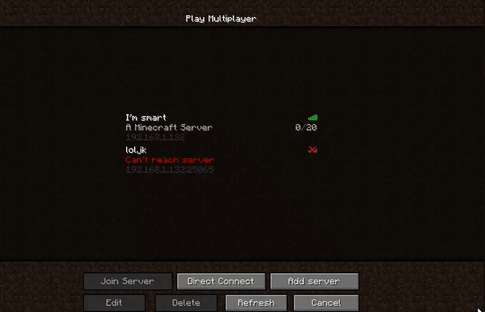

### yo dawg I heard you liked Minecraft servers.

... so I wrote a Minecraft server in a Bukkit plugin for a Minecraft server :D

This plugin is for Minecraft release 1.0.

### Installing this plugin

Drop the plugin jar into your server's plugins folder, reload the server, and connect to the same IP as your server port `25065`.

Early testing version:

Logging into the server:

### For other devs

I built this against `craftbukkit-1.0.0-SNAPSHOT.jar`

### License

MIT, have fun.

#### Disclaimer

I'm a tad rusty as a programmer, so excuse my single-threaded monster.
